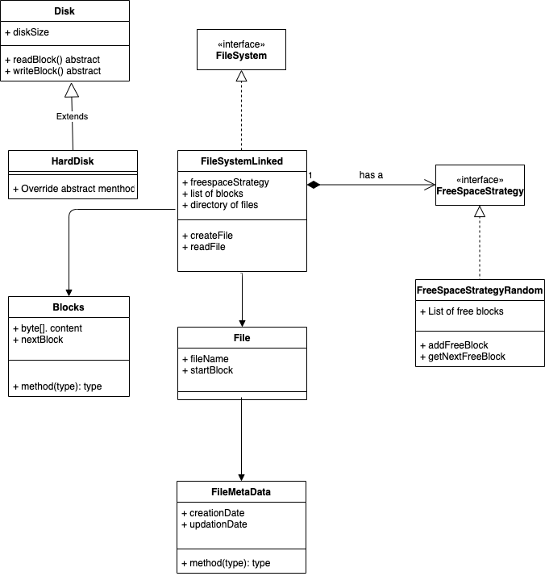

# FileSystem
Following are the various classes with their description:
  - Disk : It is an abstract class. Has api for read and writing to the blocks and has common methods if any related to disk.
  - HDisk : Implementation of disk interface
  - FreeSpaceStrategy : Interface having apis to get nextfreeslot, addfreeslot 
  - FreeSpaceStrategyRandom : Implementation of FreeSpaceStrategy where free block is returned anywhere from the disk if present
  - Block : The unit level class for disk. Each block has capabillity to store content in it and points to nextlogical block
  - File : Logical model of a file, containing file name and metadata
  - FileMetaData : Metdata related to file such as creation and updation time and description
  - FileSystem : Interface having API for create and read file and so on.
  - FileSystemLinked : Implementation of File system using Linked approach.

### Flow

  - We first create the disk with a size and blocksize. This will mimic a mounting operation of disk of given size having fixed number of blocks. Number of blocks is calculated from disk size and blocksize.
  - Before starting a FileSystem component, we need a strategy to access free blocks as and when needed by the file system. A Random strategy implementation is used here and is injected in the FileSystem constructor. In random strategy we keep a list of connected free blocks and we return a free block anywhere from the memory.
  - A new Filesystem Object is then created to process file operation. FileSystemLinked is used here which is an implementation of Filesystem interface. It has to instantiate with the free space strategy and disk.
  - While creating the File, FileSystemLinked stores the content of file in random blocks and connect these blocks together using nextLogicalBlock field of block. It fetches the free block from the given strategy. The first block will be stored against the File object and mapping of file name and file object will be saved in a map so that while reading a file, first starting block of file can be retreived from File object. 
  - Deleting a file will set all the linked blocks of that file as free to be used again. Block content is not set to null as it happens in real scenario. It is just tagged as free and will be overridden in next disk write.
  - Exceptions : At any time , if it is not possible to create file because of less memory or it is not possible to read file because file doesn't exists, appropriate exception will be thrown.

### Rationale
  - Since an actual disk just cares about going to block in constant time and gives the content of that block, disk is implemented as interface. So if some other disk hardware comes up, like magentic etc, it can implement its read and write operations on blocks in their own way.
  - FreeSpace is implemented using Strategy pattern and present in the FileSystem class as abstracted strategy so that in future if we come up with other freeStratgey like FCFS(where first free block will be returned) or AdjacentStrategy(where immediate free block next to currentblock will be returned), we can plug it and just and inject it to the FileSystem while initiating, no need to change them inside the FileSystem implementation.
  - Block, File and FileMetaData is segregated functionality wise, so that changes in one, doesn't forces changes in others
  - FileSystem is exposed through APIs. So that if we want to implement different file system implemenation, like index based instead of linked based, we can implement and interface API like create and read will remains the same.
  - Benefit of Linked implementation is that their is no external fragmentation as each block will be used if it is free. Internal fragmentation will be there though.

### Further Improvements
There are many many improvements that can be incorporated : 
  - Storing the current status of open files and their current seek position so that file can be repeteadly read from prev place. 
  - Block class can be abstracted to a general class, say Node, so that we can extend it and form special blocks like superblock and index nodes.
  - Data about disk and metadata should be written to disk too in dedicated blocks and address of those blocks can be stored in a super block
  - FileSystem should handle different files accordingly. For example right now it is text, but in future a image file may come, which should be read and written in different way. So FileHandler can be used inside Filesystem which will have different file handling implementation like TextFileHandler, ImageFileHandler and so on.
  - More exceptions should be added : For file permission etc
  - Adding owner functionality and access right related to files.
  - File model can be improved more

Note : In the following class diagram not all methods and fields are added to classes. It is just created to get a basic flow at one glance.

